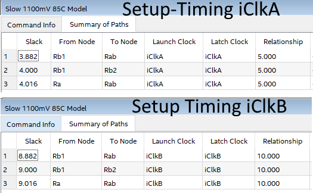

# AFN2 Timing Analysis of Internally Generated Clocks in TimeQuest

## Vorwort
Dieses Guide wurde für die AFN2 ILV des Studienganges ESD (FH OÖ Campus Hagenberg) erstellt.
In der AFN2 ILV erstellen die Studierenden eienn Guide mit einem beliebigen Thema passend zu Advanced-FPGA-Design, um sich tiefer mit FPGAs beschäftigen zu können und zu lernen, wie man Guides hält, wie es in Firmen üblich ist.

In der SLL1 LVA war ich in meinem Team zuständig für das FPGA-Design. Für die Kommunikation mit Sensoren habe ich den SPI-Master-VHDL-Code von Digikey ([Link](https://forum.digikey.com/t/spi-master-vhdl/12717)) verwendet, da Design-Reuse Zeit spart.
Bei der Wahl dieser IP habe ich mir den Implementierung angesehen und bemerkt, dass der SPI-Takt SCLK intern über einen Clock-Divider erzeugt wird.
Ich habe dieses Thema gewählt, weil ich mich näher mit der Timing-Analyse intern generierter Taktsignale befassen wollte.

## Verwendete Software
Quartus Prime 21.1 Lite

## Hauptquelle
Als Hauptquelle wurde das Tech Note "Timing Analysis of Internally Generated Clocks" aus dem Jahr 2009 verwendet.

## Einführung

> **Info:** Vor dem Guide wird den LVA-Teilnehmer zur Einführung die Einführung-PowerPoint präsentiert. Diese findet man hier (TODO Github link)

Moderne FPGA-Designs sind heute größtenteils Synchron-Sequentiell aufgebaut. Üblicherweise verwenden diese externe Taktsignale, wie auch intern generierte Taktsignale. Diese können *Gated* oder *Derived* sein. Dieser Guide soll den LVA-Teilnehmern verschiedenen Typen intern generierter Taktsignale näherbringen und Empfehlungen für die Implementierung und Timing-Analyse für Intel FPGAs bieten.

Generell ist die Verwendung extern erzeugter Taktsignale zu empfehlen. Intern generierte Taktsignale können Funktions- und Timing-Probleme verursachen.
Takte, die mit Kombinatorik erzeugt werden (Gated-Clocks), können Glitches verursachen, welche zu Hold-Time-Verletzungen führen können.

In den heutigen komplexen Designs ist es nicht möglich ganz ohne intern generierter Taktsignale auszukommen. Beispielsweise bieten Mikrocontroller häufig die Möglichkeit über Multiplexer zwischen verschiedenen Taktsignalen zu wählen und über Clock-Divider und PLLs verschiedene Taktfrequenzen einzustellen. Auch das Ein- und Abschalten von Peripherals kann über intern generiere Takte (Enabled-Clocks) bewerkstelligt werden.
Grund für das interne Verringern der Taktrate oder Deaktivieren des Taktes kann beispielsweise das Energiesparen sein.
Grund für das interne Erhöhen der Taktrate kann sein, dass die Kommunikation mit anderen Chips eine höhere Taktrate erfordert, welche aber von den externen Referenz-Takten nicht erreicht wird.

Es gibt zwei Kategorien von intern generieren Taktsignalen: *Gated-Clocks* und *Derived-Clocks*
Gated-Clocks sind grundsätzlich kombinatorische Schaltungen und stellen keine *Timing-Nodes* (Register, Latches oder PLLs) dar. Aus diesem Grund ist das Setzen von Timing-Constraints in manchen Fällen nicht nötig. In manchen Fällen ist das Setzen von Timing-Contraints dennoch nötig. Sie können jedoch auch um Timing-Nodes erweitert werden, wodurch das Setzen von Timing-Constraints auf jeden Fall nötig wird. 
Derived-Clocks bestehen aus Registern, Latches oder PLLS (=Timing-Nodes). Sie erzeugen üblichweise neue Taktsignale im Design

### Gates_Clocks
- Inverted-Clocks
- Buffered-Clocks
- Enabled-Clocks
- Multiplexed-Clocks
- Fed-Back-Clocks

### Derived_Clocks
- Toggle-Flipflop-Clocks
- Ripple-Counter-Clocks
- Sync-Counter-Clocks
- PLL-Clocks

## Guide

### Auffrischung: Clock-Skew
Als Clock-Skew wird der Taktversatz zwischen Registern bezeichnet. Clock-Skew entsteht hauptsächlich durch die Tatsache, dass sich Register an verschiedenen Stellen im Chip befinden und daher unterschiedlich weit von der Taktquelle entfernt sind. Dadurch kommt der Takt unterschiedlich spät bei den Registern an. Unter solchen Umständen kann es zu Timing-Verletzungen kommen.  
Der Clock-Skew ist eines der Gründe, weshalb man für synchron sequentielle Designs einen Clock-Tree verwendet. Clock-Trees sind Netzwerke aus Puffern. Diese Puffer haben Verzögerungen.  
Der Fitter hat die Möglichkeit Register auf verschiedene Ebenen des Clock-Trees zu setzen, damit die Taktflanken in etwa bei allen Registern zur selben Zeit ankommen.

### Gated-Clocks
Es gibt eine große Vielfalt an Gated-Clocks. Sie reichen von einfacher *Inverted-Clocks* zu *extern rückgekoppelten Takten (=Fed Back Clocks)*.
Üblicherweise werden diese zum Wechseln und abschalten von Taktsignalen verwenden. Dies kann für Energiesparmaßnahen, für Tests und für das Wechseln zwischen verschiedenen Taktfrequenzen zur Laufzeit von Nutzen sein.

#### Inverted-Clocks
1. In synchronen Schaltungen kann es nötig sein, dass etwas in weniger als einem Taktzyklus erledigt werden muss. Ein bekanntes Beispiel dafür sind Double-Data-Rate-Schaltungen (z.B. DDR-Speicher).

    Es gibt zwei Möglichkeiten Inverted-Clocks zu erzeugen. Entweder man invertiert ein bereits vorhandenes Taktsignal, oder man erzeugt aus dem Taktsignal, welches um 180° Phasenverschoben ist. Dies könnte beispielsweise mit einer PLL erreicht werden. Von letzterem ist aber abzuraten, da ersteres bei weitem einfacher implementiert werden kann.

    Eine LUT (Look-Up-Table) zu verwenden wäre ein Weg dies zu erreichen. Diese Methode würde *Clock-Skew* am Ziel-Register erzeugen und wird daher nicht empfohlen

    


    Stattdessen verwendet man den bereits vorhanden invertierten Takt-Eingang von Registern.

    


2. Versuchen wir mittels VHDL Beschreibung eine Inverted-Clock zu erzeugen. Sehen wir uns dafür den Code vom Design inverted_clk_gated an.
In inverted_clk_gated wird auf 3 verschiedene Arten eine Inverted-Clock beschrieben.

3. Synthetisiere das Design und sieh dir im Technology-Map-Viewer das Ergebnis an. Fällt etwas auf?

4. Das Ergebnis: Egal, wie die Inverted-Clock beschrieben wird, die Synthese erzeugt immer die ideale Lösung und verwendet die den invertierten Takt-Eingang der Register.
Die meisten Altera/Intel FPGAs haben eine programmierbare Einstellung zwischen invertiertem und nicht-invertiertem Takteingang.

    Man braucht nicht zu befürchten, versehentlich die schlechtere Variante implementiert zu haben.

    

5. Öffne die SDC-Datei inverted_clk_gated.sdc.

    Welche Timing-Constaints müssen für die Inverted-Clock in der SDC-Datei gesetzt werden?  
    Die Antwort ist: Keine. 
    
    Inverted-Clocks sind Gated-Clocks. Gated-Clocks bestehen aus Kombinatorik und beinhalten keine Timing-Nodes (wie z.B. Register).
    In unserem Fall ist nicht einmal zusätzliche Kombinatorik erzeugt worden.
    Die SDC-Datei muss daher für die Inverted-Clock nicht verändert werden.
    Der Timing-Analyzer versteht die Invertierung und zieht sie in seine Berechnungen mit ein. Einzig ein *create_clock* Statement wird in der SDC-Datei benötigt.

6. Um zu sehen, dass der Timing-Analyzer die Inverted-Clock automatisch erkennt, können wir den Timing-Analyzer verwenden.
    Öffne den Timing-Analyzer und führe den Task *Report Timing...* aus.
    Es öffnet sich das *Report Timing*-Fenster. Wähle unter *Analysis type* *Setup* aus, um die Setup-Analyse durchzuführen. Lass alle andere Felder unverändert und drück auf den Button *Report Timing*.
    

7. Wie wir sehen können ist die Latch-Edge **nicht** die auf die Launch-Edge folgende steigende Flanke, wie wir es aus AFN2 Lab0, Lab2 und Lab3 kennen. Die Latch-Edge ist die auf die Launch-Edge folgende fallende Flanke.  
    Die *Setup Relationship* ist mit 10 ns die Hälfte eines Taktzyklus (definiert in der SDC-Datei mit 20 ns)  
    Der Timing-Analyzer hat das Design also tatsächlich automatisch richtig verstanden.

8. Ein Problem mit dieser Methode gibt es, wenn das für die Invertierung verwendete Taktsignal nicht 50%-Duty-Cycle hat. In diesem Fall ist die Inverted-Clock nicht um 180° Phasen-Verschoben.  
   In diesem Fall könnte es sein, dass das Timing nicht eingehalten werden kann.  
   Möchte man in diesem Fall dennoch eine Phasenverschiebung von 180° erreichen, kann man eine PLL verwenden.

#### Buffered-Clocks
1. Taktsignale können in den FPGA über extra dafür vorgesehene Takt-Inputs, aber auch über einfache I/O-Inputs eingespeist werden.  
In den meisten Fällen ist es ratsam die für Taktsignal vorgesehenen Inputs zu verwenden. Das erlaubt dem Taktsignal den Low-Skew-Global-Buffer (Clock-Trees) zu verwenden, was für die interne Timing-Analyse einfacher zu handhaben ist.  

    Takte über einfache I/O-Inputs einzuspeisen sollte grundsätzlich vermieden werden, außer man ist sich sicher, dass man einen niedrigen Fan-Out hat und, dass es zu keinen Timing-Problemen kommen wird.
    Es gibt keine speziellen SDC-Constraints für einfache I/O-Puffer.  
    Bei Takten, die nicht dem Global-Buffer verwenden, sind Hold-Zeit-Verletzungen möglich, da es beim Fitting weniger Möglichkeiten gibt solche Timing-Probleme auszugleichen.
    Im Falle einer Hold-Zeit-Verletzung sollte man nicht **nicht** versuchen manuell kombinatorische Verzögerungen einzubauen. Solche Verzögerungsketten sind nicht zuverlässig, da die Verzögerung je nach Fertigungsprozess, der Spannung und der Temperatur variiert.

2. Öffne das VHDL-Code von bufferd_clk_gated und mache dich mit der Implementierung vertraut.   
   Es werden 2x 512 Register angelegt. Einmal werden sie mit einem Takt von einem Clock-Input versorgt und einmal mit einem Takt aus einem GPIO-Pin.
   Für die SDC- und die *.qsf-Datei dienten jene vom Terasic DE1-SoC-Board als Basis.
   In der SDC-Datei wurde der GPIO-Input mit *create_clock* als Taktsignal definiert, damit dieser im Timing-Analyzer betrachtet werden kann.


3. Synthetisiere das Design, öffne den Timing-Analyzer und führe mit den Task *Report Timing...* für beide Taktsignale eine Setup-Timing-Analyse durch. Was fällt auf?

4. Bei beiden Taktsignalen ergibt sich ein ähnlich hoher Slack. Aber warum?  
   Der Grund dafür ist unser FPGA, der Cyclone-V. Dieser verfügt nicht nur über ein Global-Buffer. Der Cyclone-V-FPGA verfügt über folgende Clock-Networks:  
   - Global clock (GCLK) networks  
   - Regional clock (RCLK) networks  
   - Periphery clock (PCLK) network  
  
    <pr> </pr>
5.  Speziell die Regional-Clock-Networks sind für uns hier interessant:  
    "RCLK networks are only applicable to the quadrant they drive into. RCLK networks provide the lowest
    clock insertion delay and skew for logic contained within a single device quadrant. The Cyclone V IOEs
    and internal logic within a given quadrant **can also drive RCLKs to create internally generated regional
    clocks and other high fan-out control signals**."  
    [Quelle: Cyclone V Device Handbook Volume 1: Device Interfaces and Integration Seite 64](https://www.intel.com/content/dam/www/programmable/us/en/pdfs/literature/hb/cyclone-v/cv_52006.pdf)

6. Im Falle, dass man eine FPGA hat, der so eine so eine Technologie nicht hat und aus bestimmten Gründen keinen Takt-Eingang verwenden kann, kann man sich mit einem "Work-Arround" helfen.  
Man kann die Buffered-Clock mit dem Eingang einer PLL verbinden.  
Auf das wird in diesem Guide nicht weiter eingegangen, da neueres FPGAs dieses Problem lösen.

#### Enabled-Clocks
1. Dies ist wahrscheinlich die häufigste Situation, wenn es um Gated Clocks geht. Enabled-Clocks sind Taktsignale, die von einer Clock-Aktivierung gesteuert werden.  
   
2. Man Unterschied zwischen zwei Arten von Enabled-Clocks: Statische und dynamische Enabled-Clocks.  
   Statisch bedeutet, dass das Enable-Signal sich nicht ändert, während das Design eingeschalten wird und wenn der Reset inaktiv ist. Einfach ausgedrückt: Das Enable-Signal ändern sich nicht wenn die das Design aktiv ist. Verändern sie sich trotzdem während das Design aktiv ist, muss das Design anschließend zurückgesetzt werde um korrekte Funktion sicherzustellen.
   Dynamisch bedeutet, dass sich das Enable-Signal auch ändern kann, während das Design aktiv ist.  
   Dynamische Enables sind komplexe, weil die Schaltung entweder tolerant gegen Glitches oder synchon sein muss, damit keine Timing-Verletzungen entstehen können.

3. Enabled-Clocks werden meist für Test-Zwecke undzum Stromsparen verwendet. Wenn eine Logik nicht benötigt wird, kann das Abschalten des Taktsignals Strom sparen.

4. Eine übliche Methode um eine Enabled-Clock zu bauen ist die Verwendung eines AND-Gatters. Diese Schaltung sollte allen Bekannt sein, die an CHD5 teilgenommen haben.  
   
   Diese Schaltung ist nicht zu empfehlen, da sie zum Clock-Skew beiträgt und sensitiv für Glitches ist.  
   Letzteres lässt sich vermeiden, indem man das Register vor den Enable-Eingang schaltet, wodurch man ein synchrones Clock-Enable erhält. Im Idealfall ist das vorgeschaltete Register auf die fallende Taktflanke sensitiv, sodass eine Deaktivierung Wirksam werden kann, bevor noch Daten bei der nächsten steigenden Taktflanke übernommen werden können. Folgendes Bild zeigt die verbesserte Schaltung:  
   
   Clock-Enable-Schaltungen werden von Intel so empfohlen.

5. Eine andere Methode um Clocks aktivieren und deaktivieren zu können ist folgende Schaltung:  
   
   Die Enable-Logik wird hier mit einem Multiplexer im Datenpfad implementiert. Dadurch wird durch die Schaltung nicht zum Clock-Skew beigetragen.  
   Die Multiplexer-Logik in der Linken-Schaltung erfüllt die selbe Funktionalität, wie der synchrone Enable-Eingang von Registern.  
   Diese Schaltung kann wie folgt mit VHDL beschrieben werden:

    ```vhdl
        SyncEnabledClk: process (Clk, nResetAsync) is
        begin
            if nResetAsnyc = not('1') then  
                Q <= '0';
            elsif rising_edge(Clk) then
                if En = '1' then
                    Q <= D;
                else
                    Q <= Q;
                end if;
            end if;
        end process;
    ```

    Ein großer Nachteil gegenüber der vorherigen Variante ist, dass die Register hier weiterhin getaktet werden und dadurch Strom verbrauchen.
    
6. Die bevorzugte Methode zum Erstellen einer Enabled-Clock ist aber die *ALTCLKCTRL Intel FPGA IP*.  
   Es handelt sich hier um eine Hard-IP, die genau für diesen Zweck vorgesehen ist. Dadurch werden durch ihre Verwendung keine ALMs verbraucht.
   Ein weiter Vorteil ist, dass diese Hard-IP direkt mit den Clock-Trees, wie dem Global-Clock-Tree, verbunden ist.
   Die Anzahl der ALTCLKCTRL-IPs ist eingeschränkt auf die Anzahl der vorhanden Clock-Trees im FPGA.
   Die ALTRCLKCTRL-IP verwendet selbe die synchrone Enabled-Clock Schaltung mit AND-Gatter, welche bereits in Punkt 4 erklärt wurde.

7. Folgender Screenshot vom *IP Parameter Editor* in Quartus zeigt, mit welchen Clock-Trees die ALTCLKCTRL-IP im Cyclone-V-FPGA verwendet werden kann:
   

8. Folgendes Bild zeigt den einfachsten Fall, wie man die ALTCLKCTRL-IP für Enabled-Clocks verwenden kann:
    
    Der Enable-Eingang ist auf die fallende Taktflanke sensitiv und erlaubt es das aktivieren und deaktivieren des Takt-Ausgangs.

9. Öffne den VHDL Code vom Design *enabled_clk_gates* und mache dich damit vertraut.  
    Der Code instanziiert einmal eine ALTCLKCTRL-IP.
    Außerdem enthält der Code eine VHDL-Beschreibung einer synchronen Enabled-Clock mit AND-Gatter, wie sie in Punkt 4 erklärt wurde.  

10. Synthetisiere das Design und öffne den *Technology-Map-Viewer*. Was fällt auf?

1.  Im *Technology-Map-Viewer* kann man sehen, dass die VHDL-Beschreibung **nicht** inferenced wird. Es sind genau die Register und das AND-Gatter zu sehen, die im VHDL-Code beschrieben wurde.
Dennoch ist dies eine Möglichkeit eine Enabled-Clock zu erzeugen, wie im [Intel Quartus Prime Standard Edition User Guide (UG-20175) in Sektion 1.2.2.5.1](https://www.intel.com/content/www/us/en/docs/programmable/683323/18-1/recommended-clock-gating-methods.html) erklärt wird.  

    Darüber hinaus kann man sehen, dass für die ALTCLKCTRL-IP keine Register und LUTs verwendet werden.


12. Es wird auch erklärt, dass es wichtig ist, dass der Ausgang des AND-Gatters in der SDC-Datei als Takt angegeben werden muss. Andernfalls würde der Timing-Analyzer den Pfad über das Gating-Register als längsten Taktpfad analysieren, was zu einem verfälschten Clock-Skew führen würde.

13. [In bestimmten Fällen kann das Umwandeln die in VHDL beschriebene Enabled-Clock zu Clock-Enable-Pins automatisch umgewandelt werden](https://www.intel.com/content/www/us/en/programmable/quartushelp/current/index.htm#logicops/logicops/def_synth_gated_clock_conversion.htm) um zu helfen den Clock-Skew zu reduzieren und schließlich eine genauere Timing-Analyse zu erzeugen.  
    Dies kann durch das Einfügen des Kommandos *synth_gated_clock_conversion* in die *.qsf-Datei erzielt werden.  
    Dies hat in unserem Fall keinen nutzen, denn der Cyclone-V-FPGA unterstützt dieses Feature nicht. Unterstützte FPGAs sind: Arria series, Cyclone III, Cyclone® IV, Stratix III, Stratix IV, and Stratix V.

14. Kurz zurück zur ALTCLKCTRL-Hard-IP. Die ALTCLKCTRL-Hard-IP kann nicht nur als Enabled-Clock verwendet werden, sondern auch als Multiplexed-Clock. Dies kann über Parameter eingestellt werden.  
    Was eine Multiplexed-Clock ist wird als im folgenden Abschnitt erklärt

#### Multiplexed-Clocks
1. Eine weitere gängige Art von Gated-Clocks sind Multiplexed-Clocks.  
   In vielen Designs muss zwischen verschiedenen Taktfrequenzen gewählt werden. Der Wechsel auf eine höhere Taktfrequenz kann nötig sein, wenn eine höhere Rechenleistung gefordert ist oder eine Schnittstelle es erfordert. Der Wechsel auf eine niedrigere Taktfrequenz kann von Vorteil sein, wenn man Energie sparen möchte.

2. Wird eine Multiplexed-Clock eingesetzt, muss die Timing-Anaylse für alle möglichen Frequenzen durchgeführt werden, um korrekte Ausführung sicherzustellen.

3. Man unterschieden zwischen zwei Arten von Multiplexed-Clocks: Externe und interne Multiplexed-Clocks.  
   Beide Arten haben Konsequenzen auf die SDC-Kommandos, welche notwendig sind, um eine korrekte Timing-Analyse sicherzustellen.  

4. Bei externen Multiplexed-Clocks kann ein echter externer Multiplexer eingesetzt werden. Es könnte aber auch einfach über eine Bestückungsoption (engl. *Population-Option*) verschiedene Oszillatoren bestückt werden.  
   Folgendes Bild zeigt eine externe Multiplexed-Clock mit 2 möglichen Taktsignalen:
   

    Jede mögliche externe Multiplexed-Clock muss in der SDC-Datei mit *create_clock* definiert werden.  
    Mit *set_clock_groups* werden die Taktsignale als unabhängig voneinander definiert.  
    Folgendes Bild zeigt ein Beispiel, wie die SDC-Datei aussehen könnte:
    

    Zuerst werden mit *create_clock* die beiden externen Multiplexed-Clocks definiert. Anschließend werden sie mit *set_clock_groups* als voneinander unabhängig definiert. Dies ist bei Multiplexed-Clocks nötig, weil immer nur eine der beiden Taktsignale verwendet wird. So wird die Timing-Analyse für beide Taktsignale unabhängig voneinander durchgeführt.

5. Externe Multiplexed-Clocks sind die einfachsten mit denen man zutun haben kann.  
   Wenn Multiplexed-Clocks intern generiert werden, müssen wir zusätzlich in der Kontroll-Logik sicherstellen, dass die Taktssignale korrekt im FPGA ausgewählt werden.

6. Es gibt zwei Arten intern generierter Multiplexed-Clocks: Statische und dynamische. 
   Statische Multiplexed-Clocks verändern sich, wie statische Enabled-Clocks, nicht während ein Design aktiv ist. Verändern sie sich trotzdem, muss das Design zurückgesetzt werden, um korrekte Funktion sicherzustellen. 

   Dynamsiche Multiplexed-Clocks können sich auch verändern während das Design aktiv ist. Diese müssen, im Gegensatz zu statischen Multiplexed-Clocks, sicherstellen, dass sie frei von Glitches sind.

7. Folgendes Bild zeigt die einfachste      Multiplexed-Clock-Schaltung:
     
   Diese Schaltung wird nicht empfohlen, da sie in einer LUT implementiert wird Glitches auftreten können, wenn zwischen Taktsignalen gewechselt wird. Aus diesem Grund eignet sich diese Schaltung nur als statische Multiplexed-Clock.  
   Da der Ausgang des Multiplexers direkt an den Takt-Eingang von Registern angelegt wird, erhöht diese Schaltung den Clock-Skew.
   Wenn diese Methode verwendet wird, sollte sichergestellt werden, dass der Ausgang des Multiplexers mit einem Clock-Tree, wie z.B.: dem Global-Buffer, verbunden wird.

8. Für diese Schaltung können die selben SDC-Constraints, wie für die externe Multiplexed-Clock in Punkt 4 verwendet werden.
   
9. Anstelle eine oder mehrere LUTs für die Multiplexed-Clock zu verwenden, kann die ALTCLKCTRL-IP verwendet werden. Sie ist eine speziell für solche Zwecke vorgesehene Hard-IP. 

10. Wir sehen uns nun an, wie man Designs mit statischen Multiplexed-Clocks implementiert. Öffne dafür den VHDL-Code vom Design static_muxed_clk_gated und untersuche den Code.

11. Der Code inkludiert eine ALTCLKCTRL-IP, welche als Multiplexed-Clock parametrisiert ist. Mit dem Eingangssignal *iClkSel* kann man zwischen iClkA und iClkB wählen.
Die Multiplexed-Clock taktet eine Synchron-Sequentielle-Schaltung mit 4 Registern. Die Funktionsweise dieser Schaltung ist absolut unerheblich. Sie stammt aus der Hauptquelle (Timing Analysis of Internally Generated Clocks). Sie ist so aufgebaut, damit die Timing-Analyse nachher einfach verständlich ist.
    Folgende Abbildung zeigt eine Schaltung mit der ALTCLKCTRL-IP als statische Multiplexed-Clock:
    

12. Öffne nun die SDC-Datei *static_muxed_clk_gated.sdc*.

13. In der SDC-Datei werden zuerst mit *create_clock* die beide Clocks definiert. 
    Die SDC-Constraints sind auch hier die Selben, wie in Punkt 4.
    Mit *set_clock_groups* wird dem Timing-Analyzer mitgeteilt, dass die beiden Taktsignale unabhängig voneinander sind. Das ist notwendig weil zum einen die beiden Taktsignale nie gleichzeitig anliegen werden und eine Timing-Analyse daher nicht nötig ist. Außerdem Teilen sich beide Taktsignale den selben Pfad, was bei einer Timing-Analyse zu falschen Ergebnissen führen würde.

14. Synthetisiere das Design. Und öffne anschließend den Timing-Analyzer.
15. Starte den Task *Report Timing...*. Unter *Clocks > To clock* wähle einmal iClkA aus. Damit wurde iClk als *Destination-Clock* ausgewählt.  
    Führe eine Setup-Timing-Analyse durch. Wiederhole anschließend den selben Vorgang für iClkB.
16. Die Launch- und die Latch-Edge sieht genauso aus wie erwartet: Die Setup-Relationship entspricht der Taktperiode der jeweiligen Taktsignale.  
    Was wir auch sehen ist, dass die Timing-Analyse durch *set_clock_groups* für beide Taktsignale unabhängig voneinander durchgeführt wurde. Das entspricht dem was wir in AFN2 Lab03 bereits gelernt haben.  
    Auch zu sehen: Es wurde das Timing für alle Pfade zwischen den Daten-Pfaden der miteinander verbunden Register berechnet. Folgende Abbildung zeigt die *Summary of Paths*
    
    Wie man sieht wurden für beide Taktsignale alle Datenpfade (Ra zu Rab, Rb1 zu Rab und Rb1 zu Rb1) analysiert.

17. Nun wollen wir uns mit den Problemen von Designs mit Multiplexed-Clocks widmen. Öffne dafür den VHDL-Code vom Design *static_muxed_clk_crossed_gated*.

18. Es ist das selbe Design, nur dass das Register Ra nun von iClkA, statt der Multiplexed-Clock getaktet wird.

19. Wenn wir nun noch einmal die Timing-Analyse durchführen fällt auf, dass sich die *Summary of Paths* verändert hat. Folgendes Bild zeigt die *Summary of Paths* von iClkA und iClkB.
  
    Zu sehen ist, dass in der Timing-Analyse für iClkB der Pfad von Ra zu Rab nicht berechnet wurde.
    Wenn wir uns an unsere SDC-Datei *static_muxed_clk_crossed_gated.sdc*, welches die selben Constraints enthält wie das vom vorherigen Design, zurück erinnern, dann merken mir, dass wir iClkA und iClkB mit *set_clock_groups* als unabhängig voneinander definiert haben. Das bedeutet, dass Pfade zwischen den beiden Takt-Domänen nicht analysiert werden.  
    Nun haben wir ein Dilemma: Einerseits sind iClkA und iClkB nun nicht mehr unabhängig voneinander. Andererseits erfordert die Multiplexed-Clock, dass wir iClkA und iClkB als voneinander unabhängig definieren, weil beide sich den selben Pfad teilen und daher ein falsches Timing berechnet werden würde.

20. In diesem Fall muss die SDC-Datei etwas angepasst/erweitert werden. Aber anstelle es zu erweitern wechseln wir auf eine andere Revision des Quartus-Projekts.  
    Wechsle die Revision von *static_muxed_clk_crossed_gated* auf *static_muxed_clk_crossed_gated_better*.

21. Die SDC-Datei vom Design *static_muxed_clk_crossed_gated_better* ist etwas anders als die vom Design *static_muxed_clk_crossed_gated*.  
    Es wurden mit *create_generated_clock* zwei neue Constraints gesetzt. Damit wurden die zwei intern generierten Taktsignale clk_mux_a und clk_mux_b definiert, welche von iClkA bzw. iClkB abgeleitet sind. Dieses Constraint definiert die Multiplexed-Clock, welche eine intern generierte Clock ist.  
    Mit dem Parameter *get_pins* wird das Signal festgelegt, welches die Multiplexed-Clock ist. Als Namen dieses Signals wird **nicht**, jener verwendet, im *Technology-Map-Viewer* findet, verwendet. Dieser Name wird nicht erkannt, wodurch das Constraint von Quartus ignoriert werden würde. Das erkannt man anhand einer entsprechenden Warning.
    Den richtigen Namen findet man, indem man zuerst eine Synthese durchführt und den Timing-Analyzer öffnet. Anschließend startet man den Task *Report Timing...*. Im Fenster, welches sich anschließend öffnet, unter Targets auf einen *"..."*-Button klicken. Im Fenster, welches sich anschließend öffnet, die Collection *get_pins* auswählen und danach auf den Button *"List"* klicken. Es werden alle vorhanden Pins angezeigt. In der List den Ausgang der Multiplexed-Clock suchen und auswählen. Im Fenster ganz unten wird dann das passende *get_pins* Kommando angezeigt. Folgender Screenshot zeigt den gesamten Ablauf:
      

    Beim zweiten *create_generated_clock* muss zusätzlich ein *-add* gesetzt werden, damit das erste *create_generated_clock* nicht überschrieben wird.  

    Zum Schluss werden die intern generierten Taktsignale mit *set_clock_groups*, die mit *create_generated_clock* definiert wurden.  
    Sie ersetzen damit iClkA und iClkB. Damit sind die beiden Taktsignale iClkA und iClkB nicht mehr unabhängig voneinander.

22. Wir wollen nun prüfen ob die Timing-Analyse mit den neuen Timing-Constraints richtig durchgeführt wird.
    Synthetisiere dafür das Design und öffne den Timing-Analyzer.

23. Starte den *Report Timing...* und führe wieder die Setup-Timing-Analyse durch. Dieses mal aber nicht füt iClkA und iClkB, sondern für clk_mux_a und clk_mux_b, weil wir uns ja das Timing der Multiplexed-Clocks ansehen möchten.

24. Wie man sieht ist nun alles wieder ok. Es werden wieder alle Pfade zwischen den Registern analysiert. Folgendes Bild zeigt einen Screenshot der beiden Setup-Timing-Analysen:


25. Die ALTCLKCTRL hat nur eine bestimmte Anzahl von Multiplexer-Eingängen. Es wird **nicht** Empfohlen einen weiteren Multiplexer an den Ausgang einer Clock-Multiplexers zu hängen. Sollte dies irgendeinem Grund nicht möglich, ist der Ausgang, genau wie in unserem Beispiel, des neuen Multiplexers mit *create_generated_clock* als Takt zu constrainen.

26. Dieses Beispiel zeigt gut, wie man Multiplexed-Clocks richtig constrained. Für weitere Beispiele kann im Tech Note "Timing Analysis of Internally Generated Clocks", welches im eLearning von AFN2 zu finden ist, nachgeschlagen werden.

27. Wie bereits erwähnt sollte für Multiplexed-Clocks immer wenn möglich die ALTCLKCTRL-Hard-IP verwendet werden.
    Die ALTCLKCTRL-IP kann bis zu 4 Eingänge multiplexen. Jedoch können, zumindest laut dem Tech Note "Timing Analysis of Internally Generated Clocks", nur maximal 2 Device-Pins und maximal 2 PLL-Ausgänge verwendet werden. Das ist eine Hardware-Einschränkung, die nicht umgangen werden kann.  
    Es könnte jedoch sein, dass diese Zahlen eventuell vom Chip abhängen. Auch in FPGAs ist es nicht möglich alles mit allem miteinander zu verbinden.
    Wenn beispielsweise 3 Device-Pins verwendet werden müssen, dann muss das mit einer LUTs (=VHDL-Beschreibung) implementiert werden. Es muss dabei aber darauf geachtet werden, dass der Ausgang des Multiplexers in diesem Fall an einen Clock-Tree angebunden wird, damit die Clock-Skew minimal bleibt. 
    
28. Bis jetzt wurden nur statische interne Multiplexed-Clocks behandelt. Bei dieser Art von Multiplexed-Clocks können Glitches auftreten was nicht tolerierbar ist, wenn das getaktete Design aktiv ist.  
    Um eine dynamische Multiplexed-Clock zu implementieren ist zusätzliche Logik notwendig. Es wird ein Clock-Enable eingebaut und eine Logik, die das Umschalten steuert. Die Multiplexed-Clock muss also um eine Gated-Clock erweitert werden.  
    Das Taktsignal wird von zuerst deaktiviert, dann erfolgt der Wechsel und anschließend kann das Taktsignal wieder aktiviert wird.
    
29. Leider ist die Implementierung etwas komplizierter als die erklärte Sequenz wirkt. Im folgenden wird eine Schaltung für eine dynamische Multiplexed-Clock erklärt.
    
   Die Logik zum Steuern der Multiplexed-Clock kann als FSM (Finite-State-Machine) implementiert werden. Folgende Maßnahmen sind nötig um ein Glitch-Freies Wechseln des Taktsignals zur Laufzeit zu ermöglichen: 
       1. Für das Clock-Enable und das Clock-Multiplexing wird die ALTCLKCTRL-IP verwendet.
       2. Die beiden Eingangssignale clk_sel und reset werden für alle Taktsignale einsynchronisiert. In diesem Fall für clk_a und clk_b.
       3. Für jedes Takt-Signal identische FSMs implementiert. In diesem Fall 2.
       4. Jede FSM hat eine en_out und sel_out Ausgänge.
       5. Wenn die FSMs eine Änderung am clk_sel-Eingang erkennen, wird die Multiplexed-Clock mit dem en_out Ausgang synchron zur der **aktuell** eingestellten Taktes deaktiviert. Es muss synchron zur aktuell eingestellten Taktflanke sein, da die ALTCLKCTRL-IP von diesem Taktsignal getaktet wird.
       6. Die ALTCLKCTRL übernimmt das en_out bei der nächsten fallenden Flanke, des **aktuell** eingestellten Taktes. Dieses Verhalten wurde bereits in der Sektion "Enabled-Clocks" besprochen.
       7. Bei der nächsten steigenden Taktflanke des **aktuell** eingestellten Taktes wird sel_out gesetzt um das Taktsignal zu wechseln.
       8. Bei der nächsten steigenden Flanke des **neu gewählten** Taktes kann die Multiplexed-Clock mit en_out wieder aktiviert werden.
       9. Dieses Schema funktioniert für mehrere Taktsignale mit gleicher Frequenz wie auch mit Taktsignalen mit verschiedener Frequenz.
       10. Der Synchronisierungsaufwand muss betrieben werden, damit die Kontrollsignale sel_out und en_out nicht die Register der ALTCLKCTRL-IP in den Metastabilen Zustand versetzen.

Die die SDC-Datei dieser Schaltung ist sehr einfach. Sie sieht genau so aus, wie die aus Punkt 4. Die Taktsignale mit *create_clock* definiert werden und mit *set_clock_group* als unabhängig voneinander definiert werden.


#### Fed-Back-Clocks

1. Fed-Back-Clocks sind Taktsignale, die im FPGA im FPGA erzeugt werden, über Device-Pins nach außen gereicht werden und anschließend mit über einen Device-Pin wieder eingespeist werden.
2. Bei älteren FPGAs (z.B. Altera APEX-II-Familie) war das Beispielsweise für interne Multiplexed-Clocks notwendig, da diese keine Multiplexer and einen Global-Clock-Tree anhängen konnten.
3. Annahme: Die interne Multiplexed-Clock hat in so einem Fall einen hohen Fan-Out.  
   Der einzige Weg dennoch eine Multiplexed-Clock intern zu implementieren wäre der Weg über die Leiterplatte zu einem Takteingang.
4. Folgende Abbildung zeigt eine Schaltung mit Fed-Back-Clock.
    

5. Diese Schaltung oder Fed-Back-Clocks im Allgemeinen mögen zwar einfach sein, aber das besondere ist das einzigartige Constraining des Timings in der SDC-Datei.

6. Folgende Abbildung zeigt die passende SDC-Datei für die Schaltung in Punkt 4:
   

7. Die erste Hälfte ist uns bereits aus der Sektion "Multiplexed-Clocks" bekannt. Sie setzt notwendigen Constraints für die interne statische Multiplexed-Clock.  
   Ab dem Kommentar "# Create the input clocks" beginnt der für uns neue Teil.  
   Mit *create_generated_clock* werden die Rückgekoppelten Multiplexed-Clocks als intern generiertes Taktsignal definiert.  
   Mit *set_clock_latency* wird die minimale und die maximale Latenz der Rückgekoppelten Taktsignale definiert. Dies ist nötig, weil der Timing-Analyzer diese Information im Fall von externen Signalen nicht aus dem Fitter erhalten kann.  
   Über externe Routen kann die Latenz relativ groß werden, weshalb die Latenz auf keinen Fall zu vernachlässigen ist.  
   Das Constraint für die Latenz muss gesetzt werden, denn ohne dieses wird das Timing für clk_out zu clk_in falsch berechnet.  

8. Ein moderneres Beispiel mit mehr Praxis Relevanz ist in folgender Abbildung zu sehen:

Die Abbildung zeigt die Takt-Schnittstelle zu einem DDR-Speicherbaustein.
Für die meisten DDR-Schnittstellen (Stand 2009) wird für den Schreibzugriff intern mit einer PLL ein um 90° Phasenverschobener Takt erzeugt.  
Das Taktssignal wird extern an die DDR-Speicher-Bausteine gesendet. Von dort aus wird das Taktsignal an den FPGA zurückgesendet, wo es dann für Lesezugriffe verwendet wird.  

9. Das Timing ist für diese Schaltung fast gleich wie in Punkt 6.
Zur minimalen und maximalen Latenz sollten jedoch das minimale bzw. maximale Propagation-Delay t<sub>PD</sub> miteinbezogen werden.

### Derived-Clocks
Derived-Clocks reichen von ganz einfachen Register-Schaltungen wie Toggle-Flipflops bis hin zu komplexeren Schaltungen wie PLLs.  
In allen Fällen ist das setzen eines *create_generated_clock* Constraints notwendig.

#### Toggle-Flipflop-Clocks
1. Die einfachste Art von Derived-Clocks sind Toggle-Flipflos. Sie verdoppeln die Taktperiode und können daher als Clock-Divider betrachtet werden, die den Takt um 2 Teilen.
2. Folgende Abbildung zeigt eine Toggle-Flipflop-Schaltung bestehend aus D-Flipflop und NOT-Gatter:
   

3. Die Timing-Constraints sind für diese Schaltung sehr einfach.  
   Mit *create_clock*  wird der Referenztakt definiert und mit *create_generated_clock* wird die Derived-Clock, die von der Toggle-Flipflop-Schaltung erzeugt wird, definiert. Der Parameter *-divide_by 2* definiert, dass dieser Takt den Ursprungstakt um 2 teilt.  
   Folgende Abbildung zeigt die SDC-Datei für die Toggle-Flipflop-Schaltung aus Punkt 2:
   

4. Gibt es in der Schaltung mehrere Toggle-Flipflop-Schaltungen, die als Taktquelle verwendet werden, sind weitere *create_generated_clock*-Constraints zu setzen.  
   Die folgende Abbildung zeigt eine Schaltung inklusive SDC-Datei zum erzeugen zweier Takte, die zueinander um 180° Phasenverschoben sind. Sie besteht aus 
2 Toggle-Flipflop-Schaltungen.


#### Ripple-Counter-Clocks
1. Wenn ein Taktsignal um einen größeren Wert geteilt werden muss, kann ein Ripple-Counter verwendet werden.
   Folgende Abbildung zeigt eine Ripple-Counter-Schaltung:
     

2. Im Grunde genommen ist eine Ripple-Counter-Clocks mehrere Toggle-Flipflop-Clocks, die die hintereinander geschaltet sind. Jede Stufe wird mit dem Takt des der vorigen Toggle-Flipflop-Schaltung getaktet. So wird in jeder Stufe der Takt um 2 geilt, wodurch man ein Taktsignal um mehr als nur 2 Teilen kann.
   Die Verwendung dieser Schaltung ist nicht zu empfehlen, den es handelt sich um eine asynchrone Schaltung. Mit jeder Stufe steigt die Verzögerung des geteilten Taktsignals, da der Takt die D-Flipflops durchlaufen muss. Die Verzögerung ist leider auch nicht Konstant sondern hängt von der Temperatur, dem Fertigungsprozess und der Spannung ab.  
   Diese Schaltung verursacht dadurch, abhängig von den Betriebsbedingungen und der Anzahl der Stufen, einen potentiell großen Clock-Skew und sollte daher unter allen Umständen vermieden werden.  
   Quartus gibt eine Warnung aus, wenn es diese Schaltung erkennt.
3. Jedoch ist die Ripple-Counter-Schaltung sehr einfach und gut verständlich. Daher eignet sie sich gut um das Constraining von Derived-Clocks verstehen zu lernen.

4. Die Timing-Constraints für diese Schaltung ist sehr einfach. Der Ausgang jeder Toggle-Flipflop-Clock-Stufe taktet die nachfolgende Stufe. Spätestens die letzte Stufe taktet dann ein oder mehrere Designs.  
   Da der Ausgang jeder Stufe als Takt verwendet wird, muss jeder Ausgang mit *create_generated_clock* als generierter Takt definiert werden.  
   Das Constraining des Timings erinnert an jenes der Toggle-Flipflop-Clocks.  
   Folgende Abbildung zeigt die SDC-Datei für die Ripple-Counter-Clock-Schaltung aus Punkt 1:  
   

5. Die Ripple-Counter-Schaltung ist, wegen der Verzögerung durch die Flipflops, in der Elektronik-Ausbildung ein Musterbeispiel dafür, wie man keinen Zähler baut.  
   Ein besserer Weg einen Clock-Divider zu implementieren, ist es einen synchronen Zähler (Synchronous-Counter-Clocks) zu implementieren.


### Synchronous-Counter-Clocks
1. Synchronous-Counter-Clocks werden mit synchronen Zählern implementiert. Diese Art von Zähler ist bereits gut aus dem Bachelor-Studium bekannt.
2. Diese Methode reduziert den Clock-Skew am Ende der letzten Stufe. Außerdem ist der Clock-Skew hier näherungsweise konstant. Er wird durch die Clock-To-Output-Verzögerung t<sub>CO</sub> des Registers der Toggle-Flipflop-Schaltung verursacht, deren Divided-Clock verwendet wird.
3. Folgende Abbildung zeigt eine Schaltung die Teils von einer Synchronous-Counter-Clocks getaktet wird:   
   Die Schaltung erzeugt einen um 4 geteilten Takt clk_in, welcher vom Takt clk abgeleitet ist.  

4. Auch für diese Schaltung sind die SDC-Constraints sehr einfach, wie in folgender Abbildung zu sehen ist:
   

5. Zwischen dem Register reg2 und dem Register reg_out1 kreuzen sich die zwei Taktdomäne. reg_out1 wird mit dem 4 mal langsameren Taktsignal getaktet.  
   Obwohl die Timing-Constraints korrekt gesetzt wurden und die beiden Taktdomäne synchron zueinander sind kann es zu Hold-Zeit-Verletzung kommen.
   Grund dafür ist die Clock-To-Output-Verzögerung t<sub>CO</sub> vom Register div4 und das Wire-Delay. Dadurch kommt die steigende Taktflanke bei reg_out1 später an, wodurch eine Änderung am Ausgang von reg2 eine Hold-Zeit-Verletzung verursacht.

6. Die potentielle Hold-Zeit-Verletzung lässt sich mit der Fitter-Einstellung *Optimize Hold Times for All Paths* beheben. Dadurch werden das Wire-Delay zum betroffenen Register reg_out1 erhöht, wodurch die steigende Taktflanke noch später bei reg_out1 ankommt, was die Timing-Probleme löst.

7. Nur weil man nach diesem Guide (hoffentlich), weiß wie man Derived-Clocks implementiert, heißt es nicht, dass man das soll.  
   Wenn es einen Weg gibt die Problemstellung effizient über den Datenpfad zu Lösen, sollte das auch getan werden. Genauso wie wir es vor AFN2 gelernt haben.  
   Folgende Schaltung zeigt, wie man die Selbe Funktionalität mit dem Enable-Eingang von Registern löst:
   

8. Die Schaltung wird ohne spezielle Timing-Contraints das Timing erfüllen und korrekt funktionieren. Jedoch wird der Timing-Analyzer die Schaltung fehlinterpretieren.  
Der Pfad zwischen reg_out1 und reg_out2 wird sich immer nur alle 4 Taktflanken verändern. Das heißt, dass ein dieser Pfad als Multicycle-Pfad definiert werden kann ("Opening the Window", siehe AFN2 Lab02), um eine korrekte Timing-Analyse zu erzielen.  
Folgende Abbildung zeigt die passende SDC-Datei zu der Schaltung: 

9. Für die Setup-Timing-Analyse wird ein Multicycle-Pfad von 4 definiert. Grund dafür ist, weil der Abstand zwischen Launch- und Latch-Edge 4 Taktzyklen breit ist.
10. Für die Hold-Timing-Analyse wird ein Multicycle-Pfad von 3 definiert. Grund dafür ist, dass bei der Hold-Analyse einen Taktzyklus früher geprüft werden muss ob die Hold-Zeit verletzt wird. Anders ausgedrückt die Latch-Edge entspricht der Launch-Edge. (siehe AFN2 Lab01.


### PLL-Clocks
1. Intel-FPGAs besitzen konfigurierbare PLLs.  
In fast jedem Fall gibt es einen besseren Weg ein intern generiertes Taktsignal mit PLLs zu erzeugen.  
PLLs können Gated-Clocks ersetzen indem man sie als Inverted-Clocks, Enabled-Clocks und statische Multiplexed-Clocks verwendet.  
PLLs können auch als Derived-Clocks, also Clock-Divider und Clock-Multiplier verwendet werden.  
Abgesehen von der Flexibilität haben PLLs auch weitere Vorteile:  
   1. Dank des Phasenkompensators, einer Komponente innerhalb der PLL, werden Änderungen an der Phase beobachtet und können so Schwankungen, die durch Temperatur- und Spannung-Schwankungen entstehen, kompensiert werden
   2. Dank des Bandpass-Filters von PLLs können hochfrequente Eingangs-Jitter am Ausgang rausgefiltert werden.
   3. PLLs sind dynamisch rekonfigurierbar.
   4. Global-Buffering: Die Ausgänge von PLLs sind mit den Global-Clock-Trees verbunden.  


2. Intern mit PLLs generierte Taktsignale können manuell mit *create_generated_clock* constrained werden. Der einfachere Weg für eine PLL Constraints zu setzen ist jedoch das SDC-Kommando *derive_pll_clocks*, welches einfach in die SDC-Datei eingefügt werden kann. (siehe AFN2 Lab02)

3. Da PLLs bereits in der CHD4 Übung und Vorlesung erklärt wurden, wird hier nicht weiter darauf eingegangen.
